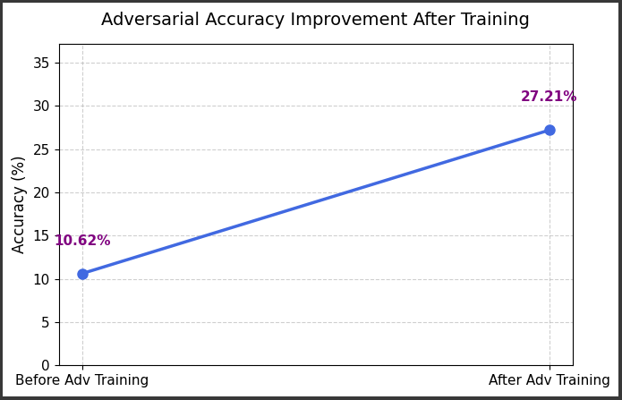

# 🧠 Fooling AI, Then Defending It - A Hands-on Adversarial Robustness Demo


Welcome to a journey that reveals the **hidden vulnerability** of modern AI and shows how we can fight back.

Have you ever wondered if neural networks can be fooled with just a tiny tweak in their input?

🤔 *What if changing a single pixel could trick an AI into seeing a 3 as an 8?*

This notebook isn't just a demo it's an **interactive story** of breaking and defending a deep learning model. Built entirely in **PyTorch** and powered by **IBM Adversarial Robustness Toolbox (ART)**, this project is a hands-on crash course on adversarial machine learning.

---

## 🧩 What’s Inside?

We start with a clean PyTorch model trained on MNIST digits fast, accurate, confident.

But then, things take a turn.

We craft adversarial attacks using **FGSM (Fast Gradient Sign Method)** subtle, imperceptible changes that cause our model to misclassify with shocking ease.

And finally... we fight back.

We retrain the model with **adversarial training** using ART, making it more robust, aware, and prepared for real-world attacks.

---

## 🌪️ The Threat

> Even the smartest AI can be blind.

A well-trained model sees an image like this:

 - Predicted "7"

But when we apply FGSM:

 - Predicted "3"

| Original Image | Adversarial Image | Model Prediction |
| -------------- | ----------------- | ---------------- |
|               |  | 3                |


### Visualization



It gets completely fooled. The prediction changes. Confidence flips. The model breaks.

And this could happen in facial recognition, autonomous driving, or financial fraud detection.

That’s why adversarial robustness matters.

---

## 🛡️ The Defense

We use **AdversarialTrainer** from ART to fine-tune our model against FGSM attacks. The notebook shows:

- Before vs After predictions
- Accuracy drop under attack
- How much adversarial training helps

It’s not just about code, it’s about awareness.

---

## 🧪 Run It Yourself

Clone the repo and step into the world of adversarial ML:

```bash
git clone https://github.com/DivyanshuSingh96/FoolTheMachine.git
cd IBM-Adversarial-Attacks
pip install -r requirements.txt
